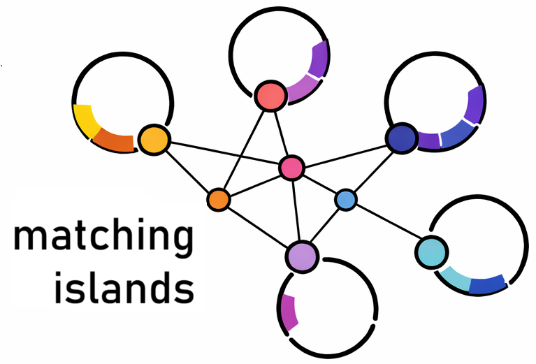

<p align="center">
  
</p>

# matching islands

**Comparative genomic island analysis based on GIPSy2 predictions.**

`matching_islands.py` is a Python pipeline for the comparative analysis of genomic islands predicted by **GIPSy2**. The pipeline supports both **protein-level** and **nucleotide-level** comparisons and generates similarity matrices, similarity networks, containment analyses, heatmaps, dendrograms, and Louvain community clustering.

At the protein level, the pipeline can additionally identify **shared and exclusive proteins** between pairs of genomic islands.

---

## Overview

The pipeline analyzes four genomic island categories:

* **Virulence**; **Resistance**; **Symbiosis** and **Metabolic**

Two sequence-comparison modes are available:

| Mode       | Input  | Alignment        |
| ---------- | ------ | ---------------- |
| Protein    | `.faa` | DIAMOND `blastp` |
| Nucleotide | `.fna` | BLAST+ `blastn`  |

The general workflow is:

```text
GIPSy2 results
      │
      ▼
Select sequence level
Protein / Nucleotide
      │
      ▼
Select island category
Virulence / Resistance /
Symbiosis / Metabolic
      │
      ▼
Prepare sequences
      │
      ▼
All-vs-all alignment
DIAMOND blastp / BLASTn
      │
      ▼
Pairwise island comparisons
      │
      ├── Similarity
      ├── Coverage
      ├── Relationship classification
      └── Shared/exclusive proteins*
      │
      ▼
Similarity matrix
      │
      ├── Heatmap + dendrogram
      ├── Similarity network
      ├── Louvain communities
      └── Containment network
      │
      ▼
Summary and output files

* Protein mode only
```

---

## Requirements

### Python

Python ≥ 3.9 is recommended.

Install the required Python packages with:

```bash
pip install biopython numpy pandas matplotlib scipy networkx python-louvain
```

### External software

The pipeline requires:

* **DIAMOND** for protein-level analyses;
* **BLAST+** for nucleotide-level analyses.

Make sure the programs are available in your `PATH`:

```bash
diamond version
blastn -version
makeblastdb -version
```

---

## Input structure

The input directory should contain the GIPSy2 results organized by genome/strain.

### Protein mode

Protein sequences must be located in `Amino_acids/`:

```text
GIPSy2_results/
├── strain_1/
│   └── Amino_acids/
│       ├── Virulence_Island_1.faa
│       ├── Virulence_Island_2.faa
│       └── ...
├── strain_2/
│   └── Amino_acids/
│       └── ...
└── ...
```

### Nucleotide mode

Nucleotide sequences must be located in `Islands_nucleotides/`:

```text
GIPSy2_results/
├── strain_1/
│   └── Islands_nucleotides/
│       ├── Virulence_Island_1.fna
│       ├── Virulence_Island_2.fna
│       └── ...
├── strain_2/
│   └── Islands_nucleotides/
│       └── ...
└── ...
```

The appropriate directory and file extension are selected automatically according to the analysis mode.

---

## Usage

General syntax:

```bash
python3 matching_islands.py -i <GIPSy2_results_folder> <mode> <island_type> [options]
```

### Protein-level analysis

For example, to analyze virulence islands:

```bash
python3 matching_islands.py -i GIPSy2_results/ -p -vir
```

### Nucleotide-level analysis

```bash
python3 matching_islands.py -i GIPSy2_results/ -n -vir
```

### Island categories

```text
-vir    Virulence islands
-res    Resistance islands
-sym    Symbiosis islands
-met    Metabolic islands
--all   All four islands categories
```

For example:

```bash
python3 matching_islands.py -i GIPSy2_results/ -p -res
python3 matching_islands.py -i GIPSy2_results/ -p -sym
python3 matching_islands.py -i GIPSy2_results/ -p -met
```

To analyze all island categories:

```bash
python3 matching_islands.py -i GIPSy2_results/ -p --all
```

---

## Optional analyses

### Heatmap and dendrogram

Use `--plot` to generate the similarity heatmap and corresponding dendrogram:

```bash
python3 matching_islands.py -i GIPSy2_results/ -p -vir --plot
```

The heatmap represents pairwise island similarity and includes hierarchical clustering based on **average linkage**.

The corresponding tree is also exported in **Newick** format.

---

### Louvain community detection

Use `--louvain` to identify communities in the similarity network:

```bash
python3 matching_islands.py -i GIPSy2_results/ -p -vir --louvain
```

`--plot` and `--louvain` can be used together:

```bash
python3 matching_islands.py -i GIPSy2_results/ -p -vir --plot --louvain
```

---

### Shared and exclusive proteins

The `--shared` option is available **only in protein mode**:

```bash
python3 matching_islands.py -i GIPSy2_results/ -p -vir --shared
```

For each qualifying pair of islands, the pipeline generates FASTA files containing shared and exclusive proteins.
`--plot`, `--louvain` and `--shared` can also be used together.

---

### Reusing existing results

The `--from-results` option allows previously generated results to be reused without repeating the all-vs-all alignment:

```bash
python3 matching_islands.py -i GIPSy2_results/ -p -vir --from-results --plot
```

This is useful when only additional visualizations or community analyses are required.

---

# Similarity calculations

## Protein-level comparison

Protein comparisons are performed using **DIAMOND blastp**.

For each protein in the query island, the pipeline identifies the **best hit** in the target island based on bit score.

The island-level similarity is calculated as the mean identity of the best hits across **all proteins in the query island**:

* proteins with a significant hit contribute their best-hit identity;
* proteins without a significant hit contribute **0%**;
* the calculation therefore considers the complete protein content of the island;
* comparisons are performed in both directions (**A→B** and **B→A**);
* the final island similarity is the mean of the two directional identities.

### Protein thresholds

```text
High-similarity threshold: 90%
Protein containment coverage: 95%
```

The 90% threshold is used to define high-similarity homologs for:

* shared protein identification;
* protein-content coverage;
* containment classification.

---

## Nucleotide-level comparison

Nucleotide comparisons are performed using **BLASTn**.

For each pair of islands, the pipeline calculates similarity in both directions:

```text
A → B; B → A
```

Nucleotide identity is calculated from the bases represented by the non-redundant BLASTn HSPs.
Coverage is calculated from the union of the positions covered by the selected HSPs.

### Nucleotide thresholds

```text
Identity threshold: 95%
Containment coverage threshold: 99.5%
```

Two islands are classified as **equivalent** when both directions satisfy the identity and coverage criteria.

---

# Relationship classification

Pairwise island relationships are classified according to reciprocal coverage and similarity.

| Relationship            | Interpretation                             |
| ----------------------- | ------------------------------------------ |
| **Equivalent islands**  | High similarity and reciprocal coverage    |
| **A is contained in B** | Island A is contained within island B      |
| **B is contained in A** | Island B is contained within island A      |
| **Partial overlap**     | Partial sequence/protein-content overlap   |
| **No shared proteins**  | No qualifying protein homologs detected    |
| **No shared sequence**  | No qualifying nucleotide sequence detected |

The specific criteria depend on the sequence level being analyzed.

---

# Output structure

Results are automatically organized according to the analysis mode.

### Protein mode

```text
GIPSy2_results/
└── results_matching_islands_p/
    ├── virulence/
    ├── resistance/
    ├── symbiosis/
    └── metabolic/
```

### Nucleotide mode

```text
GIPSy2_results/
└── results_matching_islands_n/
    ├── virulence/
    ├── resistance/
    ├── symbiosis/
    └── metabolic/
```

Only the categories selected by the user are generated.

---

# Main output files

For each island category, the pipeline can generate:

```text
*_comparison_results_summary.txt
*_global_analysis_summary.txt
*_island_pairwise_coverage.csv
*_similarity_matrix.tsv
renamed_*_cytoscape_network_classified.csv
*_island_containment_network.pdf
*_island_containment_network_interpretation.txt
```

With `--plot`:

```text
*_heatmap.pdf
*_dendrogram.newick
```

With `--louvain`:

```text
louvain_clustering/
├── island_communities.tsv
├── community_statistics.tsv
└── louvain_summary.txt
```

With `--shared` in protein mode:

```text
protein_comparison/
├── strain_PI1__strain_PI2/
│   ├── shared_A.faa
│   ├── shared_B.faa
│   ├── exclusive_A.faa
│   ├── exclusive_B.faa
│   └── shared_pairs.tsv
└── ...
```

---

# Output interpretation

### Similarity matrix

`*_similarity_matrix.tsv`

A symmetric matrix containing the average pairwise similarity between genomic islands.

Values range from:

```text
0–100%
```

The matrix is used as the basis for hierarchical clustering and heatmap generation.

---

### Heatmap

`*_heatmap.pdf`

Visual representation of the similarity matrix with hierarchical dendrograms.

Distances are calculated as:

```text
Distance = 1 − Similarity
```

and clustering is performed using **average linkage**.

---

### Similarity network

`renamed_*_cytoscape_network_classified.csv`

Network containing:

```text
Source
Target
Weight
Group
```

where:

* `Source` = source island;
* `Target` = target island;
* `Weight` = average similarity;
* `Group` = similarity category.

The file can be imported into **Cytoscape** for network visualization and downstream analysis.

---

### Pairwise coverage

`*_island_pairwise_coverage.csv`

Contains, for each island pair:

* island size;
* average similarity;
* coverage A→B;
* coverage B→A;
* relationship classification.

For protein analyses, island size is represented as the number of genes/proteins.

For nucleotide analyses, island size is represented as the number of base pairs.

---

### Containment network

`*_island_containment_network.pdf`

Graphical representation of detected containment relationships between genomic islands.

The accompanying:

```text
*_island_containment_network_interpretation.txt
```

provides the criteria and relationships represented in the network.

---

### Louvain clustering

`island_communities.tsv`

Assigns each island to a detected community.

`community_statistics.tsv` summarizes the size and composition of each community.

`louvain_summary.txt` provides an overall description of the network and detected communities.

---

# Example: complete protein analysis

A complete virulence-island analysis including the similarity heatmap, Louvain clustering, and shared/exclusive protein identification can be run with:

```bash
python3 matching_islands.py -i GIPSy2_results/ -p --all --plot --louvain --shared
```

For a complete nucleotide-level analysis:

```bash
python3 matching_islands.py -i GIPSy2_results/ -n --all --plot --louvain
```

---

# Methodological notes

* Only genomic islands present in the input GIPSy2 results are compared.
* Pairwise comparisons are processed in parallel using the available CPU cores.
* Each pair of islands is evaluated once, while reciprocal metrics are calculated when required.
* In protein mode, proteins without a significant hit contribute 0% to the query-to-target average identity.
* In nucleotide mode, overlapping HSPs are processed to avoid double-counting aligned positions.
* Protein shared/exclusive outputs are generated only for homologs meeting the high-similarity criterion.
* Louvain community detection uses `random_state=42` for reproducibility.
* Heatmap clustering uses **average linkage** on a distance matrix derived from pairwise similarity.
* The pipeline generates separate result directories for protein (`results_matching_islands_p`) and nucleotide (`results_matching_islands_n`) analyses.

---

`matching_islands.py`
Version: **17 August 2026**

## Citation

If you use **matching_islands** in your research, please cite this repository and the GIPSy2 software article:

### matching_islands

GitHub repository: https://github.com/depaulaj/matching-islands

### GIPSy2

Rodrigues, D.L.N., Sodrzeieski, P.A., Parise, D. et al. (2026). GIPSy2: high-performance and scalable genomic island prediction software. *Scientific Reports*.  
https://doi.org/10.1038/s41598-026-53034-0

## License
This repository is licensed under the MIT License.

# Status
🚧 Active development. The pipeline is stable but may evolve as new analyses are incorporated.

If came up any questions, please contact me: janainedpaula@gmail.com. 
